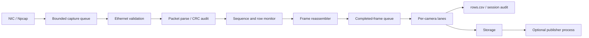

# Host Camera Packet Receiver

[中文说明](README.zh-CN.md)

Host-side Python receiver and calibration toolkit for FPGA-originated raw-Ethernet camera rows. It receives fixed 128-byte payload packets carried in EtherType `0x88B5` frames, validates packet semantics and CRC status, monitors row continuity, reassembles frames, writes CSV/PGM evidence, and optionally publishes completed images in a separate process.

The FPGA/RTL implementation is maintained separately in [FPGA-Based-Camera-Buffer](https://github.com/YuweiZhang-002/FPGA-Based-Camera-Buffer). This repository owns the detailed host receiver, intrinsic calibration, stereo pairing, extrinsic solve, and independent holdout validation procedures.

## Architecture



The queue boundaries are intentional. Capture is isolated from Python processing; reassembly is isolated from slow storage; CSV writing is bounded independently; and `--publish-images process` moves image publication out of the lane thread and its GIL/I/O critical path. A downstream disk or image-conversion stall therefore does not automatically become an ingress packet-loss burst.

The processing depth is often described as six observable layers:

| Layer | Responsibility | Main evidence |
|---|---|---|
| 1 | Npcap ingress | `Capture ingress`, `ps_recv`, `ps_drop` |
| 2 | Ethernet length/type validation | matching Ethernet and bad-length counters |
| 3 | Fixed packet parse and CRC audit | `parsed_ok`, CRC/sync/length errors |
| 4 | Packet/row continuity monitoring | duplicate, gap, out-of-order and row-jump counters |
| 5 | Per-camera frame reassembly | completed/incomplete frame records |
| 6 | CSV, PGM/archive and optional publication | `rows.csv`, `summary.csv`, PGM files, sink counters |

No evidence is promoted across layers: a valid Ethernet frame does not prove a valid camera row; a complete frame does not prove a valid calibration grid; and a low numerical calibration residual does not by itself prove a physically publishable stereo transform.

## Installation

Requirements: Windows, Python, and Npcap for live capture. Create an isolated environment:

```powershell
python -m venv .venv
.\.venv\Scripts\python.exe -m pip install -r .\requirements-live.txt
.\.venv\Scripts\python.exe -m pip install -r .\requirements-calibration.txt
```

`requirements-calibration.txt` currently constrains OpenCV to `<5` because the project identified a fisheye multi-view regression in OpenCV 5.0.0.93. Dependencies are installed from their package indexes; no third-party source is vendored here.

## Live receiver quick start

List Npcap interfaces and copy the exact device name:

```powershell
.\.venv\Scripts\python.exe -m taxi_receiver.cli --list
```

Capture both cameras into a fresh directory:

```powershell
$interface = '\Device\NPF_{REPLACE-WITH-ACTUAL-GUID}'
$runRoot = Join-Path $PWD ('runs\{0:yyyyMMdd_HHmmss}_dual' -f (Get-Date))

.\scripts_ps\capture\run_receiver.ps1 `
  -Interface $interface `
  -ImagesRoot $runRoot `
  -CameraIds '0,1' `
  -SplitByCamera on `
  -ImagePolicy strict `
  -PublishFrames complete `
  -PublishImages process
```

The command remains active until `Ctrl+C`; this is normal for a live receiver. Verify that `$interface` is not a placeholder and that `cam0`/`cam1` directories receive PGM and `rows.csv` outputs.

## Calibration entry points

Use the complete runbook before running calibration:

- [English calibration pipeline](docs/calibration_pipeline.md)
- [中文标定流程](docs/calibration_pipeline.zh-CN.md)

The public PowerShell wrappers are:

```powershell
.\scripts_ps\calibration\run_intrinsic_calibration.ps1 -PreflightOnly <required paths>
.\scripts_ps\calibration\run_extrinsic_calibration.ps1 -PreflightOnly <required paths>
```

After preflight, remove `-PreflightOnly` to execute. Both scripts support `-WhatIf`, reject non-empty output roots, preserve Training/V1/V2 separation, and write `run_manifest.json`. Intrinsics are solved independently for each camera. Extrinsics freeze both K/D documents, require identical physical point-index sets, solve cam0-to-cam1 R/t from Training pairs, and then validate the frozen transform on independent V1 and V2 pairs.

## Packet and CRC interpretation

The host distinguishes two CRC locations:

- FPGA status bit `0x10` reports the ingress MCU-to-FPGA CRC comparison result when that check is enabled in the FPGA design.
- The egress packet CRC is recalculated by the FPGA and checked by the host for the FPGA-to-Ethernet/host path.

A correct egress CRC with status `0x10` points upstream of Ethernet. An incorrect egress CRC points to the emitted packet or its transport/capture path. CRC policy is a receiver audit concern and is not a substitute for calibration image-quality validation.

## Exit codes and statuses

The receiver CLI uses its existing code-specific exit meanings documented in [docs/protocol_and_reproduction.md](docs/protocol_and_reproduction.md). Calibration wrappers report `0` only after every requested stage passes; a non-zero Python stage is preserved as a failed run in the manifest and the wrapper stops. Algorithm JSON status values remain authoritative: `acceptable`, `limited`, `unacceptable`, `ready`, `not_ready`, `pass`, and `fail` must not be treated as interchangeable.

## Troubleshooting order

Start at the first failing observable point:

1. `ps_recv`/capture ingress: NIC, Npcap permissions, device GUID.
2. Matching Ethernet: EtherType, physical link, source filtering.
3. `parsed_ok`: fixed payload length, sync, cam ID, CRC mode.
4. Row continuity: sequence gaps, duplicates, row jumps.
5. Frame completion: missing rows and per-camera routing.
6. Publication: lane drops, CSV drops, publisher queue and disk latency.
7. Calibration: complete grid, pose diversity, point-set identity and holdout quality.

Do not diagnose camera calibration from packet arrival alone, and do not diagnose transport loss from a failed circle-grid detection alone.

## Documentation

- [Protocol and reproduction guide](docs/protocol_and_reproduction.md)
- [Calibration pipeline](docs/calibration_pipeline.md)
- [Quick reference](CHEATSHEET.md)
- [Performance optimization evidence](docs/notes/p11_python_receiver_performance_optimization.md)
- [Migration manifest](COPY_MANIFEST.md)
- [Differences from the source workspace](DIVERGENCE.md)

## Verification status

- The pre-calibration host baseline recorded `157 passed, 2 skipped`.
- The migrated calibration subset recorded `57 passed` under Python 3.14.6, NumPy 2.5.1, and OpenCV 4.14.0.
- The combined public candidate currently records `216 passed, 2 skipped`.
- Live interface enumeration was previously verified; an actual privileged capture must still be verified on the publication machine and NIC.
- Historical PCAP, PGM, JSON, CSV, K/D, R/t and Attempt outputs are deliberately not included in this public source repository.

## License

Released under the MIT License. The FPGA repository and its separately obtained third-party hardware dependencies retain their own licenses; this repository's MIT license does not relicense them.
