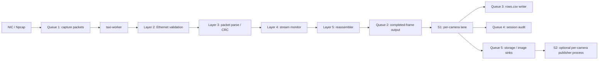

# Host Camera Packet Receiver

[中文说明](README.zh-CN.md)

Host-side Python receiver for FPGA-originated raw Ethernet image rows. The board sends EtherType `0x88B5` frames with fixed 128-byte packets; this repository receives, validates, reassembles, archives, and optionally republishes them on the PC side.

## Architecture

The pipeline is deliberately layered and queue-bounded:



Queue boundaries matter:

- Queue 1 isolates live capture from the Python worker.
- Queue 2 isolates reassembly from slow storage and image publication.
- Queue 3 isolates `rows.csv` formatting and flush latency.
- Queue 4 is the synchronous session audit path.
- Queue 5 isolates sink failures and lets S2 move image publication off the lane thread.

S1 is the per-camera lane split. S2 is the multi-process image publication path.

## Release documentation map

The complete protocol and reproduction guide is [here](docs/protocol_and_reproduction.md). It covers the required release topics: Project Overview, System Scope, Host Receiver Architecture, 128-byte Packet Format, CRC Audit Path, Npcap Capture Mechanism, Buffer and Queue Configuration, Frame Reassembly, CSV and Image Output, Error Statistics, Installation, Interface Selection, CAM0 Test, CAM1 Test, Dual-camera Test, PCAP Replay, Directory Structure, Testing, Troubleshooting, and Known Limitations.

The current audit rule is explicit: a valid egress CRC with FPGA status `0x10` means the MCU-to-FPGA ingress CRC failed; an invalid egress CRC means the FPGA-to-Ethernet/Host path was corrupted. Both classes remain in session audit, and neither enters normal image CSV or frame reassembly.

## Quick Start

1. Install Npcap on Windows.
2. Open an elevated PowerShell if you plan to capture live traffic.
3. Create the local environment:

```powershell
python -m venv .venv
.\.venv\Scripts\python.exe -m pip install -r .\requirements-live.txt
```

4. List interfaces and copy the GUID you want:

```powershell
.\.venv\Scripts\python.exe -m taxi_receiver.cli --list
```

5. Run the receiver:

```powershell
.\run_receiver.ps1 -Interface "\\Device\\NPF_{YOUR-GUID}"
```

## Common Scenarios

Connectivity blind check:

```powershell
.\run_receiver.ps1 -Interface "\\Device\\NPF_{YOUR-GUID}" -NoRowsCsv
```

Line-rate stress test:

```powershell
.\run_receiver.ps1 -Interface "\\Device\\NPF_{YOUR-GUID}" `
  -ImagesRoot .\images `
  -QueueDepth 65536 `
  -FrameOutputQueueDepth 256 `
  -PublishImages process `
  -PublishFrames complete
```

Loss-tolerant frame capture:

```powershell
.\run_receiver.ps1 -Interface "\\Device\\NPF_{YOUR-GUID}" `
  -ImagesRoot .\images `
  -OutputRoot .\archive `
  -ImagePolicy recover-zero-fill `
  -PublishFrames eligible
```

Offline replay with the four gates:

```powershell
.\verify_s2.ps1 -ReplayPcap .\build\wire.pcapng -OutRoot .\build\s2_verify
```

## CLI Reference

| Group | Flags | Purpose |
|---|---|---|
| Capture | `--interface`, `--mode`, `--pcap-buffer-size`, `--queue-depth` | Live input and capture buffering |
| Replay | `--replay-pcap`, `--source-mac` | Offline PCAP/PCAPNG replay |
| Parse / stage depth | `--reassemble`, `--max-stage` | Stop at Layer 2/3/4/5 as needed |
| Image policy | `--image-policy`, `--max-missing-rows`, `--max-consecutive-missing` | Strict vs recover-zero-fill |
| Lane / publisher | `--split-by-camera`, `--camera-ids`, `--publish-images`, `--publisher-queue-depth` | S1 and S2 behavior |
| Output | `--output-root`, `--images-root`, `--no-rows-csv`, `--session-audit` | Archive and image sinks |
| Archiving | `--archive-root-policy`, `--archive-collision-policy` | Collision handling for completed frames |
| Misc | `--report-interval`, `--list`, `--bit-order`, `--frame-timeout` | Reporting and diagnostics |

## Exit Codes

| Code | Meaning |
|---|---|
| 0 | Success |
| 2 | Invalid arguments |
| 3 | Capture permission problem |
| 4 | Capture OSError, wrong interface, or missing Npcap |
| 5 | Scapy missing in the active environment |
| 6 | Archive root policy rejected the target root |
| 7 | A sink failed repeatedly or every submitted frame failed |

## Troubleshooting

The top-level packet-loss model is four layers deep:

- `ps_drop` lives in Npcap before Python sees the packet.
- `Capture queue drops` lives between capture and the shared worker.
- `Lane queue drops` lives between the shared worker and the per-camera lane.
- `csv_rows_dropped` lives between the lane and the rows.csv writer.

A `queue peak` only proves a queue was full at least once. `submit blocked` is the field that proves the sink is the bottleneck.

If live capture looks healthy at the queue level but `ps_drop` rises, reduce per-packet Python cost first.

## Performance Notes

All numbers below are local measurements from the current Windows host and should be read as machine-specific evidence, not universal claims.

- 40,000-packet capture sample on this host: capture callback dropped from 28.8 us/packet to 0.5 us/packet after replacing `Ether(packet_bytes)` with byte slicing; CRC16 moved from 10.5 us/packet to the `binascii.crc_hqx` path, and total packet CPU cost fell from 52.0 us to 13.5 us.
- Same sample: estimated single-core throughput rose from 19,231 pkt/s to 74,074 pkt/s.
- 923,514-frame dual-camera load: `--publish-images thread` took 83.7 s, while `--publish-images process` took 65.0 s; lane `submit blocked` fell from 17.8 s + 57.2 s to 0.000 s + 0.000 s.
- On the 9,179,893-packet live run recorded in the source notes, `ps_drop` fell from 3,047,448 (33.2%) to 0 when packet CPU cost was reduced.

## License

Released under the MIT License. This repository covers the host-side Python receiver only; the FPGA/RTL side (including third-party Ethernet IP under CERN-OHL-S) lives in a separate repository and is not licensed under these terms.

## Status

- Verified: `.venv` exists, `scapy` and `pytest` are installed, and `python -m taxi_receiver.cli --list` enumerates local interfaces.
- Verified: `pytest` in this host-only copy reports 157 passed and 2 skipped.
- Compared with docs/techical docs/word tasksheet/07_更新后的Python接收机架构演进与机制.md and 08_更新后的Python接收机复刻与压测指南.md, which recorded `154 passed`, this host-only copy is re-baselined at `157 passed / 2 skipped` in the new layout.
- Unverified in this session: a real live capture session on a privileged interface, because this stage only exercised interface enumeration.
- Unverified by design: the two repository-external pcapng regressions used by `tests/test_pcap_stdlib.py` are absent in this host-only copy, so those tests are skipped with an explicit reason.
- Known limitation: stopping S2 live capture with Ctrl+C can leave the image-publication counter at 0 even though the image files on disk are complete.

## Related Notes

- [README.zh-CN.md](README.zh-CN.md)
- [CHEATSHEET.md](CHEATSHEET.md)
- [docs/notes/p11_python_receiver_performance_optimization.md](docs/notes/p11_python_receiver_performance_optimization.md)
