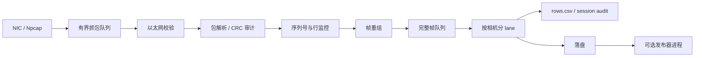

# Host Camera Packet Receiver

[English README](README.md)

这是 PRG_CAM 的上位机 Python 接收与标定仓库。它接收 FPGA 发出的 EtherType `0x88B5` 原始以太网帧，处理固定 128 字节 payload，完成包格式与 CRC 审计、行连续性监控、帧重组、CSV/PGM 落盘，以及可选的独立进程图像发布。

FPGA/RTL 实现位于独立仓库 [FPGA-Based-Camera-Buffer](https://github.com/YuweiZhang-002/FPGA-Based-Camera-Buffer)。本仓库负责详细的六层接收机、单相机内参、双目配对、固定 K/D 外参求解与独立 holdout 验证。

## 架构



这些队列边界不是装饰：抓包与 Python 消费隔离，重组与慢速落盘隔离，CSV 写入独立限流；`--publish-images process` 还把图像转换/发布移出 lane 线程及其 GIL/I/O 临界路径。因此磁盘或发布器短暂停顿不会直接反压成前端丢包。

六层可观测链路如下：

| 层 | 职责 | 主要证据 |
|---|---|---|
| 1 | Npcap 入站 | `Capture ingress`、`ps_recv`、`ps_drop` |
| 2 | 以太网长度/类型 | matching Ethernet、bad length |
| 3 | 固定包解析与 CRC | `parsed_ok`、CRC/sync/length errors |
| 4 | 包和行连续性 | gap、duplicate、out-of-order、row jump |
| 5 | 按相机重组帧 | 完整/不完整帧记录 |
| 6 | CSV、PGM、归档和发布 | `rows.csv`、`summary.csv`、PGM、sink 计数 |

本项目遵循“证据不得跨层晋升”：收到以太网帧不等于获得有效相机行，完整帧不等于找到有效圆点阵列，低重投影误差也不自动等于外参具有物理发布资格。

## 安装

Windows 实时抓包需要 Npcap。创建隔离环境：

```powershell
python -m venv .venv
.\.venv\Scripts\python.exe -m pip install -r .\requirements-live.txt
.\.venv\Scripts\python.exe -m pip install -r .\requirements-calibration.txt
```

`requirements-calibration.txt` 将 OpenCV 限制在 `<5`，原因是本项目已发现 OpenCV 5.0.0.93 的 fisheye 多视图回归问题。依赖由包管理器安装，本仓库不内嵌第三方源码。

## 接收机快速开始

先列出 Npcap 接口并复制真实设备名：

```powershell
.\.venv\Scripts\python.exe -m taxi_receiver.cli --list
```

将双路图像写入带时间戳的新目录：

```powershell
$interface = '\Device\NPF_{替换为真实GUID}'
$runRoot = Join-Path $PWD ('runs\{0:yyyyMMdd_HHmmss}_dual' -f (Get-Date))

.\run_receiver.ps1 `
  -Interface $interface `
  -ImagesRoot $runRoot `
  -CameraIds '0,1' `
  -SplitByCamera on `
  -ImagePolicy strict `
  -PublishFrames complete `
  -PublishImages process `
  -CrcMode enabled
```

接收机在按下 `Ctrl+C` 前持续运行，这是正常行为。必须确认 `$interface` 不是占位符，并观察 `$runRoot\cam0` 与 `$runRoot\cam1` 是否持续生成 PGM 和 `rows.csv`。

## 内参与外参入口

执行前先阅读：

- [中文标定完整流程](docs/calibration_pipeline.zh-CN.md)
- [English calibration pipeline](docs/calibration_pipeline.md)

两个公共 PowerShell 入口为：

```powershell
.\scripts_ps\run_intrinsic_calibration.ps1 -PreflightOnly <补齐必填路径>
.\scripts_ps\run_extrinsic_calibration.ps1 -PreflightOnly <补齐必填路径>
```

预检通过后去掉 `-PreflightOnly` 才会真正计算。两个脚本都支持 `-WhatIf`，拒绝复用非空输出目录，严格区分 Training、V1、V2，并写出 `run_manifest.json`。内参按相机独立求解；外参冻结两份 K/D，要求两机使用完全相同的物理点索引集，在 Training 求 cam0→cam1 的 R/t，再由独立 V1/V2 验证冻结结果。

## CRC 的分层含义

- FPGA 状态位 `0x10` 表示启用入口检查时 MCU→FPGA 的 CRC 比较结果。
- 出口包 CRC 由 FPGA 重算并由 Host 校验，覆盖 FPGA→Ethernet→Host 路径。

因此，“出口 CRC 正确但状态含 `0x10`”指向 Ethernet 之前；“出口 CRC 错误”指向发出的包或传输/抓包链路。CRC 属于接收证据审计，不代替标定图像质量判断。

## 状态与失败判断

接收机 CLI 的退出码见 [协议与复刻说明](docs/protocol_and_reproduction.zh-CN.md)。标定包装脚本仅在所请求阶段全部通过时返回 0；任一 Python 阶段非零，脚本会停止并把失败写入 manifest。算法 JSON 的 `acceptable`、`limited`、`unacceptable`、`ready`、`not_ready`、`pass`、`fail` 含义不同，禁止只看到生成 JSON 或低 RMS 就宣布通过。

排查时从第一个异常观测点开始：

1. `ps_recv`/ingress：NIC、Npcap 权限、GUID。
2. Matching Ethernet：EtherType、物理链路、源地址过滤。
3. `parsed_ok`：包长、sync、cam ID、CRC mode。
4. 行连续性：序号间隙、重复、乱序、跳行。
5. 帧完整性：缺行和 cam0/cam1 路由。
6. 发布：lane/CSV drop、publisher queue、磁盘延迟。
7. 标定：完整网格、姿态覆盖、点集一致性和 holdout 质量。

## 文档索引

- [协议与复刻说明](docs/protocol_and_reproduction.zh-CN.md)
- [标定完整流程](docs/calibration_pipeline.zh-CN.md)
- [快速命令](CHEATSHEET.md)
- [性能优化证据](docs/notes/p11_python_receiver_performance_optimization.md)
- [迁移清单](COPY_MANIFEST.md)
- [与源工作区的差异](DIVERGENCE.md)

## 当前验证状态

- 标定迁入前的 Host 基线记录为 `157 passed, 2 skipped`。
- 迁入的标定测试子集在 Python 3.14.6、NumPy 2.5.1、OpenCV 4.14.0 下为 `57 passed`。
- 当前合并后的公开候选版本记录为 `216 passed, 2 skipped`。
- 已验证接口枚举；公开机器上的管理员权限实时抓包仍需单独执行。
- 历史 PCAP、PGM、JSON、CSV、K/D、R/t 与 Attempt 输出有意不进入公共源码仓库。

## License

本仓库采用 MIT License。FPGA 仓库以及由使用者另行获取的第三方硬件依赖保留各自许可证，本仓库不会对它们重新授权。
