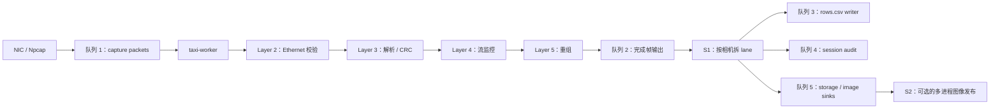

# Host Camera Packet Receiver

[English README](README.md)

这是 host 侧 Python 接收端：接收 FPGA 板发送的原始以太网图像行帧，EtherType 为 `0x88B5`，单包固定 128 字节。仓库负责接收、校验、重组、归档和可选的图像发布，不包含 FPGA/RTL 侧源码。

## 架构

流水线是分层的，并且每一层都被有界队列隔开：



五个有界边界的作用分别是：

- 队列 1 隔离实时抓包和 Python worker。
- 队列 2 隔离重组和慢速落盘 / 图像发布。
- 队列 3 隔离 `rows.csv` 格式化与 flush 延迟。
- 队列 4 是同步的 session audit 路径。
- 队列 5 隔离 sink 失败，并让 S2 把图像发布移出 lane 线程。

S1 是按相机拆 lane。S2 是把图像发布改成多进程。

## 快速开始

1. 安装 Windows 版 Npcap。
2. 如果要做 live 抓包，请用管理员 PowerShell 打开终端。
3. 创建本地环境：

```powershell
python -m venv .venv
.\.venv\Scripts\python.exe -m pip install -r .\requirements-live.txt
```

4. 列出网卡并复制你要用的 GUID：

```powershell
.\.venv\Scripts\python.exe -m taxi_receiver.cli --list
```

5. 启动接收机：

```powershell
.\run_receiver.ps1 -Interface "\\Device\\NPF_{YOUR-GUID}"
```

## 常见场景

连通性盲测：

```powershell
.\run_receiver.ps1 -Interface "\\Device\\NPF_{YOUR-GUID}" -NoRowsCsv
```

线速压测：

```powershell
.\run_receiver.ps1 -Interface "\\Device\\NPF_{YOUR-GUID}" `
  -ImagesRoot .\images `
  -QueueDepth 65536 `
  -FrameOutputQueueDepth 256 `
  -PublishImages process `
  -PublishFrames complete
```

容错救帧采集：

```powershell
.\run_receiver.ps1 -Interface "\\Device\\NPF_{YOUR-GUID}" `
  -ImagesRoot .\images `
  -OutputRoot .\archive `
  -ImagePolicy recover-zero-fill `
  -PublishFrames eligible
```

离线 replay 四道闸门：

```powershell
.\verify_s2.ps1 -ReplayPcap .\build\wire.pcapng -OutRoot .\build\s2_verify
```

## CLI 开关表

| 分组 | 开关 | 作用 |
|---|---|---|
| Capture | `--interface`, `--mode`, `--pcap-buffer-size`, `--queue-depth` | live 输入和抓包缓冲 |
| Replay | `--replay-pcap`, `--source-mac` | 离线 PCAP / PCAPNG 回放 |
| 解析 / 深度 | `--reassemble`, `--max-stage` | 按需停在 Layer 2/3/4/5 |
| 图像策略 | `--image-policy`, `--max-missing-rows`, `--max-consecutive-missing` | strict 与 recover-zero-fill |
| lane / publisher | `--split-by-camera`, `--camera-ids`, `--publish-images`, `--publisher-queue-depth` | S1 和 S2 行为 |
| 输出 | `--output-root`, `--images-root`, `--no-rows-csv`, `--session-audit` | 归档与图像 sink |
| 归档 | `--archive-root-policy`, `--archive-collision-policy` | 完成帧冲突处理 |
| 其他 | `--report-interval`, `--list`, `--bit-order`, `--frame-timeout` | 报告和诊断 |

## 退出码

| 码 | 含义 |
|---|---|
| 0 | 成功 |
| 2 | 参数错误 |
| 3 | 抓包权限问题 |
| 4 | 抓包 OSError、接口名错或 Npcap 缺失 |
| 5 | 当前环境缺 Scapy |
| 6 | archive root policy 拒绝目标根目录 |
| 7 | 某个 sink 连续失败，或所有提交帧都失败 |

## 排障

丢包模型从上往下看有四层：

- `ps_drop` 在 Npcap 内核里，Python 还没看到包就已经丢了。
- `Capture queue drops` 在 capture 和共享 worker 之间。
- `Lane queue drops` 在共享 worker 和 per-camera lane 之间。
- `csv_rows_dropped` 在 lane 和 rows.csv writer 之间。

`queue peak` 只能证明队列至少满过一次。`submit blocked` 才能证明是下游 sink 卡住了。

如果队列看起来没问题，但 `ps_drop` 在涨，先降每包 Python 成本。

## 性能说明

下面数字都是本机实测，带有明确测量条件，不是通用常数。

- 40,000 包样本（本机 Windows 主机）：把 `Ether(packet_bytes)` 改成字节切片后，capture 回调从 28.8 us/包降到 0.5 us/包；CRC16 走 `binascii.crc_hqx` 路径后，总包 CPU 成本从 52.0 us 降到 13.5 us。
- 同一组样本：单核吞吐估算从 19,231 pkt/s 提升到 74,074 pkt/s。
- 923,514 帧双相机负载：`--publish-images thread` 用时 83.7 s，`--publish-images process` 用时 65.0 s；lane `submit blocked` 从 17.8 s + 57.2 s 降到 0.000 s + 0.000 s。
- 源笔记里记录的 9,179,893 包 live run：`ps_drop` 从 3,047,448（33.2%）降到 0。

## License

本仓库采用 MIT License 发布。这里仅覆盖 host 侧 Python 接收端；FPGA/RTL 侧（包括第三方 Ethernet IP，许可证为 CERN-OHL-S）位于单独仓库中，不属于本许可范围。

## 状态

- 已验证：`.venv` 已创建，`scapy` 与 `pytest` 已安装，`python -m taxi_receiver.cli --list` 能列出本机网卡。
- 已验证：这个 host-only 副本的 `pytest` 结果是 157 passed、2 skipped。
- 与 docs/techical docs/word tasksheet/07_更新后的Python接收机架构演进与机制.md 和 08_更新后的Python接收机复刻与压测指南.md 中记录的 `154 passed` 相比，这个 host-only 副本在新目录下重新标定为 `157 passed / 2 skipped`。
- 本次会话未验证：真正对一个受限权限的 live 接口做实时抓包，因为这里只做了网卡枚举。
- 按设计跳过：`tests/test_pcap_stdlib.py` 依赖的两个仓库外 pcapng 回归产物在这个 host-only 副本里不存在，所以测试以明确 reason skip。
- 已知限制：S2 live capture 用 Ctrl+C 停止时，图像文件本身是完整的，但 IMAGE PUBLICATION 计数可能显示 0。

## 相关说明

- [README.md](README.md)
- [CHEATSHEET.md](CHEATSHEET.md)
- [docs/notes/p11_python_receiver_performance_optimization.md](docs/notes/p11_python_receiver_performance_optimization.md)
