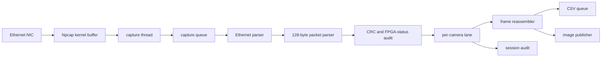

# Host Protocol and Reproduction Guide

[Chinese version](protocol_and_reproduction.zh-CN.md)

## 1. Scope and architecture

This repository contains only the host receiver: Npcap capture, Ethernet validation, 128-byte row parsing, CRC/status audit, camera lanes, frame reassembly, CSV/session audit, image storage, replay, and tests. FPGA RTL is maintained in [FPGA-Based-Camera-Buffer](https://github.com/YuweiZhang-002/FPGA-Based-Camera-Buffer).



The capture thread writes the capture queue and the worker reads it. The worker writes the per-camera lane queues; lane workers write frame output, rows CSV, session audit, and image queues. A bounded queue can either drop according to the selected policy or block the submitting producer; `drop` protects capture latency, while `block` propagates backpressure and can increase `ps_drop`. The process publisher writes image files and is fed by the image queue.

`ps_drop` counts packets dropped by the Npcap capture buffer before Python receives them. `ps_ifdrop` is an interface-level drop reported by the capture provider. They are not Python queue counters. `capture_index` is the monotonic order assigned at capture admission; `csv_sequence` is the order assigned by the CSV writer, so they diagnose reordering or queue loss independently.

A queue peak proves only that a queue was full. A rising capture queue peak with CSV queue headroom points to parser/lane pressure; a rising CSV queue peak or nonzero CSV submit blocking points to the CSV sink. Always compare both with `ps_drop` and the capture report.

## 2. Current 128-byte packet

The Ethernet payload is exactly 128 bytes. Multi-byte metadata is big-endian; the CRC tail is a big-endian integer represented low byte first on the wire by the current FPGA Byte_Replacer.

| Offset | Length | Field | Meaning |
|---:|---:|---|---|
| 0..1 | 2 | sync0 | `A5 A0` |
| 2..3 | 2 | sync1 | `5A 50` |
| 4 | 1 | cam_id | Camera lane identifier |
| 5..6 | 2 | frame_id | Big-endian frame identifier |
| 7..8 | 2 | row_idx | Big-endian row index, 0..479 |
| 9 | 1 | sender row_flags | MCU/source flags only |
| 10 | 1 | payload_len | Fixed value 80 |
| 11..12 | 2 | row_seq | Big-endian source sequence |
| 13 | 1 | FPGA diagnostic status | FPGA-owned status, independent of offset 9 |
| 14..23 | 10 | reserved | Reserved metadata bytes |
| 24..103 | 80 | image payload | One row fragment |
| 104..113 | 10 | trailer padding | Padding |
| 114..125 | 12 | trailer metadata | Current trailer fields/padding |
| 126..127 | 2 | crc16 | CRC-16/CCITT-FALSE over bytes 0..125 |

Sender flags at offset 9 are `bit0=overflow`, `bit1=final_line`, and `bit2=sender-defined row marker`. The current host does not use bit2 as a frame boundary. A frame starts at `row_idx == 0` or a changed `frame_id`, and ends at `row_idx == 479` with the final-line check.

FPGA status at offset 13 is `0x01=Line Buffer overflow`, `0x08=FPGA ingress length error`, and `0x10=MCU-to-FPGA ingress CRC error`. An egress CRC error means the received bytes 0..125 no longer match bytes 126..127. The host keeps ingress and egress failures separate:

| Egress CRC | FPGA status `0x10` | Result |
|---|---:|---|
| valid | 0 | Both links pass audit |
| valid | set | Ingress was bad; FPGA-to-host packet survived |
| invalid | any | FPGA-to-Ethernet/host path was corrupted |

Any parse, egress CRC, or FPGA diagnostic error is retained in audit counters but is not admitted to normal image CSV or frame reassembly.

## 3. Reproduction commands

Replace `<NPF_INTERFACE>`, `<OUTPUT_ROOT>`, `<PYTHON_EXE>`, and `<PCAP_FILE>`.

### Install and enumerate interfaces

```powershell
$python = '<PYTHON_EXE>'
& $python -m venv .venv
.\.venv\Scripts\python.exe -m pip install -r .\requirements-live.txt
.\.venv\Scripts\python.exe -m taxi_receiver.cli --list
```

### CAM0

```powershell
.\scripts_ps\capture\run_receiver.ps1 -Interface '\\Device\\NPF_{<NPF_INTERFACE>}' -CameraIds '0' -SplitByCamera on -ImagesRoot '<OUTPUT_ROOT>\images' -OutputRoot '<OUTPUT_ROOT>\archive' -SessionAudit on
```

### CAM1

```powershell
.\scripts_ps\capture\run_receiver.ps1 -Interface '\\Device\\NPF_{<NPF_INTERFACE>}' -CameraIds '1' -SplitByCamera on -ImagesRoot '<OUTPUT_ROOT>\images' -OutputRoot '<OUTPUT_ROOT>\archive' -SessionAudit on
```

### Dual camera

```powershell
.\scripts_ps\capture\run_receiver.ps1 -Interface '\\Device\\NPF_{<NPF_INTERFACE>}' -CameraIds '0,1' -SplitByCamera on -ImagesRoot '<OUTPUT_ROOT>\images' -OutputRoot '<OUTPUT_ROOT>\archive' -QueueDepth 65536 -FrameOutputQueueDepth 256 -PublishImages process -PublishFrames complete -SessionAudit on
```

### PCAP replay

```powershell
.\scripts_ps\diagnostics\verify_s2.ps1 -ReplayPcap '<PCAP_FILE>' -OutRoot '<OUTPUT_ROOT>\pcap_replay'
```

The replay path does not require Npcap. Live capture does, and interface selection must use the NPF name printed by `--list`.

## 4. Outputs and policies

A completed frame is archived as RAW/PGM according to the selected image policy. `rows_v2.csv` contains accepted row records and `session_audit_v2.csv` contains accepted, rejected, and transport-level audit counters. `strict` rejects incomplete frames; `recover-zero-fill` emits a frame only when missing-row limits are satisfied and records the filled rows. `row0` and `row1` are valid rows and must not be discarded when `row2` follows immediately.

## 5. Test matrix

The synthetic tests cover 480-row reassembly, consecutive row0/row1/row2, missing and duplicate rows, bad sync and length, egress CRC, FPGA status offset 13 including `0x10`, CAM0/CAM1 routing, dual-camera lanes, CSV fields, session audit, strict/recover-zero-fill, and PCAP parser behavior. Hardware live capture and the external PCAPNG regressions are environment-dependent; skipped tests report their reason.
