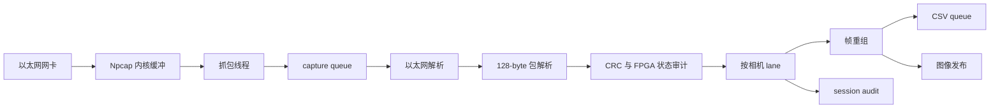

# Host 协议与复刻说明

[English version](protocol_and_reproduction.md)

## 1. 范围与架构

本仓库只包含 Host 接收机：Npcap 抓包、以太网校验、128-byte 行包解析、CRC/FPGA 状态审计、相机 lane、帧重组、CSV/session audit、图像存储、回放和测试。FPGA RTL 位于独立仓库 [FPGA-Based-Camera-Buffer](https://github.com/YuweiZhang-002/FPGA-Based-Camera-Buffer)。



抓包线程写入 capture queue，worker 读取它；worker 写入各相机 lane，lane worker 再写帧输出、rows CSV、session audit 和图像队列。队列有界时，可按策略丢弃或阻塞生产者：`drop` 优先保护抓包延迟，`block` 会传播背压并可能增加 `ps_drop`。进程发布器从图像队列读取并写盘。

`ps_drop` 是 Npcap 内核缓冲在 Python 看到数据前丢弃的包数；`ps_ifdrop` 是抓包提供者报告的接口层丢包，两者都不是 Python 队列计数。`capture_index` 是抓包接收顺序，`csv_sequence` 是 CSV writer 写入顺序，用于区分重排和队列丢失。队列 peak 只能说明队列曾经满过，应同时观察 `ps_drop`、capture queue、CSV queue 和 submit blocking。

## 2. 当前 128-byte 包格式

以太网 payload 固定为 128 bytes。多字节元数据为大端；当前 FPGA Byte_Replacer 将 CRC 尾部按低字节先发送。

| Offset | 长度 | 字段 | 含义 |
|---:|---:|---|---|
| 0..1 | 2 | sync0 | `A5 A0` |
| 2..3 | 2 | sync1 | `5A 50` |
| 4 | 1 | cam_id | 相机 lane 标识 |
| 5..6 | 2 | frame_id | 大端帧号 |
| 7..8 | 2 | row_idx | 大端行号，0..479 |
| 9 | 1 | sender row_flags | 仅 MCU/源端 flags |
| 10 | 1 | payload_len | 固定为 80 |
| 11..12 | 2 | row_seq | 大端源端序号 |
| 13 | 1 | FPGA diagnostic status | FPGA 自有状态，不与 offset 9 混合 |
| 14..23 | 10 | reserved | 保留元数据 |
| 24..103 | 80 | image payload | 一段图像行 |
| 104..113 | 10 | trailer padding | 填充 |
| 114..125 | 12 | trailer metadata | 当前尾部元数据/填充 |
| 126..127 | 2 | crc16 | 对 bytes 0..125 计算 CRC-16/CCITT-FALSE |

Offset 9：`bit0=overflow`、`bit1=final_line`、`bit2=发送端定义的 row marker`。Host 不把 bit2 当真正帧首。帧首是 `row_idx == 0` 或 `frame_id` 变化；帧尾是 `row_idx == 479` 并检查 final-line。

Offset 13：`0x01=Line Buffer overflow`、`0x08=FPGA 入口长度错误`、`0x10=MCU 到 FPGA 入口 CRC 错误`。Host 将入口 CRC 状态与出口 CRC 分开审计：出口 CRC 正确且状态 `0x10` 置位表示入口错误但 FPGA 到 Host 正常；出口 CRC 错误表示 FPGA 到 Ethernet/Host 链路损坏。错误包进入审计计数，但不进入正常图像 CSV 或帧重组。

## 3. 可复刻 PowerShell 命令

请替换 `<NPF_INTERFACE>`、`<OUTPUT_ROOT>`、`<PYTHON_EXE>`、`<PCAP_FILE>`。

```powershell
$python = '<PYTHON_EXE>'
& $python -m venv .venv
.\.venv\Scripts\python.exe -m pip install -r .\requirements-live.txt
.\.venv\Scripts\python.exe -m taxi_receiver.cli --list
```

CAM0：

```powershell
.\scripts_ps\capture\run_receiver.ps1 -Interface '\\Device\\NPF_{<NPF_INTERFACE>}' -CameraIds '0' -SplitByCamera on -ImagesRoot '<OUTPUT_ROOT>\images' -OutputRoot '<OUTPUT_ROOT>\archive' -SessionAudit on
```

CAM1：

```powershell
.\scripts_ps\capture\run_receiver.ps1 -Interface '\\Device\\NPF_{<NPF_INTERFACE>}' -CameraIds '1' -SplitByCamera on -ImagesRoot '<OUTPUT_ROOT>\images' -OutputRoot '<OUTPUT_ROOT>\archive' -SessionAudit on
```

双相机：

```powershell
.\scripts_ps\capture\run_receiver.ps1 -Interface '\\Device\\NPF_{<NPF_INTERFACE>}' -CameraIds '0,1' -SplitByCamera on -ImagesRoot '<OUTPUT_ROOT>\images' -OutputRoot '<OUTPUT_ROOT>\archive' -QueueDepth 65536 -FrameOutputQueueDepth 256 -PublishImages process -PublishFrames complete -SessionAudit on
```

PCAP 回放：

```powershell
.\scripts_ps\diagnostics\verify_s2.ps1 -ReplayPcap '<PCAP_FILE>' -OutRoot '<OUTPUT_ROOT>\pcap_replay'
```

## 4. 输出与策略

完整帧按图像策略归档为 RAW/PGM；`rows_v2.csv` 记录正常行，`session_audit_v2.csv` 记录接受、拒绝和传输层审计计数。`strict` 拒绝缺行帧；`recover-zero-fill` 在满足缺行限制时补零并记录补零行。row0、row1、row2 连续到达是合法情况。

## 5. 测试矩阵

合成测试覆盖 480 行重组、row0/row1/row2 连续到达、缺行/重复行、错误同步头/长度、出口 CRC、offset 13 的 FPGA 状态含 `0x10`、CAM0/CAM1、双相机 lane、CSV 字段、session audit、strict/recover-zero-fill 和 PCAP 解析。真实抓包及外部 PCAPNG 回归依赖硬件/本机文件，无法运行时测试会明确报告原因。
